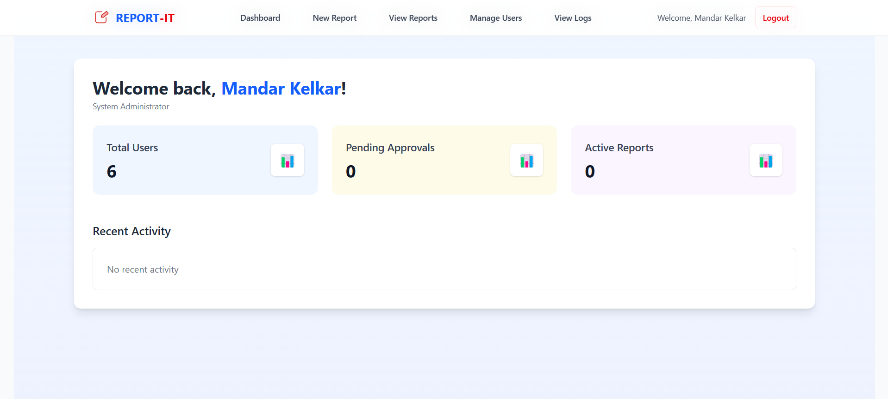
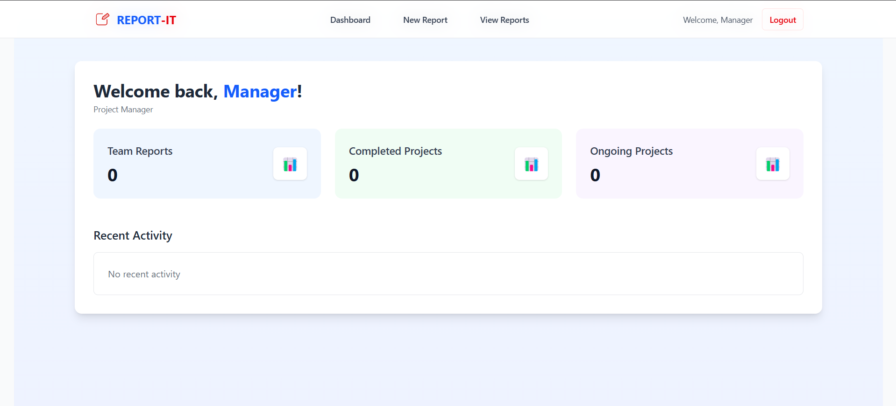
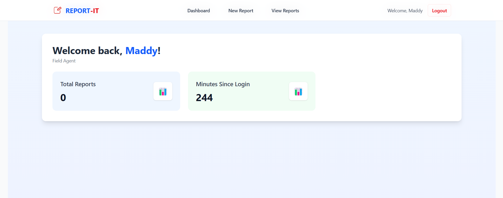

# Report-It- Field Reporting System. 

> A full-stack reporting portal to **track user activity logs**, **manage reports**, and **monitor system usage** . Built with ❤️ using **Vite+React**, **Node.js**, **MongoDB**, and **TailwindCSS**.

---


## 📝 What This Project Is

Report-It empowers field agents to document on-site visits with text, photos, and comments. Agents can:
- **Create** rich field reports, including photos of the location  
- **Browse & comment** on reports submitted by colleagues  
- **Track** their own submissions over time  

Meanwhile, managers and admins gain full visibility:
- **Managers** can view all reports and join the conversation  
- **Admins** can do everything a manager can, plus **approve/revoke** user access, **view detailed activity logs**, and **export** any subset of reports as XLSX  

This system brings real-time collaboration, auditability, and data export into one simple interface.

---

## 👤 User Flows

### Admin Flow

🔐 Login  
↓  
📊 Dashboard  
├─▶ ✨ Create Report  
├─▶ 👁️ View Report  
 └─▶ 💬 Comment  
  
├─▶ 👥 Manage Users (Admin Only)  
│   ├─▶ ✅ Approve Agents  
│   └─▶ ❌ Revoke Access  
│  
├─▶ 📜 Activity Logs (Admin Only)  
│  
└─▶ 📤 Export Data (Admin/Manager)  
    ├─▶ XLSX Reports  
    └─▶ XLSX Logs (Admin)  

═════════════════════════════════════════════

🔐 Login  
↓  
📊 Dashboard  
├─┬▶ ✨ Create Report  
│   ├─▶ 👁️ View Report  
│   └─▶ 💬 Comment  
│  
└─▶ 📤 Export Reports → XLSX  

═════════════════════════════════════════════

🔐 Login  
↓  
📊 Dashboard (Personal Stats)  
├─▶ ✨ Create Report  
└─┬▶ 👁️ View Own Reports  
     └─▶ 💬 Comment  


## 🚀 Features

- 🔒 **Authentication** — Secure login/signup with JWT tokens
- 🧠 **Role-based Access Control** — Separate flows for Admin and Users
- 📋 **Activity Logs** — Track login/logout, report submissions, etc.
- 🟢 **Real-time Online Status** — See which users are active right now
- 🌍 **IP Address and Device Info** — Logged automatically with each activity
- 🗂️ **Detailed User Reports** — Drill down into each user's history
- ⚡ **Fully Responsive UI** — Works on desktop, tablet, mobile

---

## 🛠️ Tech Stack

| Frontend | Backend | Database | Styling |
|:---------|:--------|:---------|:--------|
| Vite+React.js | Node.js + Express | MongoDB + Mongoose | TailwindCSS |

---

## 🧑‍💻 Local Setup Instructions

1. **Clone the repo:**

   ```bash
   git clone https://github.com/MandarKelkarOfficial/report-it.git
   cd report-it
   ```

2. **Frontend setup:**

   ```bash
   npm install
   npm run dev
   ```

   Runs on: `http://localhost:5173/`

3. **Backend setup:**

   ```bash
   cd backend
   npm install
   npm run start
   ```

   Runs on: `http://localhost:5000/`

4. **Environment Variables:**

   Create a `.env` file inside `/backend` folder:

   ```bash
   MONGO_URI=your_mongodb_connection_string
   JWT_SECRET=your_super_secret_key
   FRONTEND_URL=http://localhost:5173
   ```

5. **Ready to roll!** 🎸 Open your browser and login/signup to start managing users.

---

## 📸 Screenshots

### Admin Dashboard

---

### Manager Dashboard

---

### Field Agent Dashboard

---

## 📚 Folder Structure

```bash
report-it/
├── report-it/
│   ├── src/
│   │   ├── pages/
│   │   ├── components/
│   │   ├── context/
│   │   └── App.jsx
│   ├── tailwind.config.js
├── backend/
│   ├── models/
│   ├── server.js
```

---

## ⚡ Optimizations / TODOs

- [ ] Implement **WebSocket** for real-time user status (instead of polling)
- [ ] Add **Pagination** for logs if there are 1000+ records
- [ ] Enable **Admin Analytics** (charts for user growth, activity spikes)
- [ ] Deploy to **Vercel** (Frontend) and **Render** or **Railway** (Backend)

---

## 🤝 Contributing

Pull requests are welcome. For major changes, please open an issue first to discuss what you would like to change.

---

## 🧹 Cleaning tip

If you ever feel like the frontend cache is acting funky during development:

```bash
rm -rf node_modules/.vite
npm run dev
```
(Trust me, it works like black magic.)

---

## 📜 License

This project is licensed under the [MIT License](LICENSE).

---

## 👨‍🚀 Maddy's Note

_"Building software for **students and freshers** because nobody deserves to be ghosted by HR."_

---
